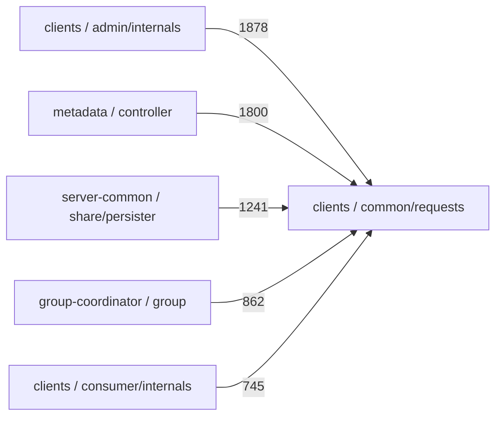

<div align="center">

# Open Mind

**A verification-first code intelligence layer for AI agents.**

Open Mind turns a local repository into deterministic, source-traceable context
that coding agents can query without relying on guesses for indexed facts: a
verbatim glossary, structure and call graphs, exact-token search, grounded Q&A
context, saved solved cases, and an MCP tool surface.

[](https://www.python.org/)
[](LICENSE)
[](#use-it-from-an-agent-mcp)
[](#verification-first-design)
[](#local-first-boundary)

</div>

Open Mind is built around one practical agent-engineering problem:

> AI agents are only useful on real codebases when their context is reliable.
> A fluent but unsupported explanation of a system is not intelligence; it is a
> production risk.

Instead of asking a model to "understand" a repository from scratch, Open Mind
builds durable artifacts from the code itself. The model, editor, or agent then
queries those artifacts. If the repository does not support a claim, Open Mind
prefers a precise "not found" over a plausible hallucination.

## Table Of Contents

- [Why Open Mind](#why-open-mind)
- [Actual Project Demo](#actual-project-demo)
- [What It Builds](#what-it-builds)
- [Built For AI Agent Workflows](#built-for-ai-agent-workflows)
- [Verification-First Design](#verification-first-design)
- [In Action](#in-action)
- [How This Differs From Generic RAG](#how-this-differs-from-generic-rag)
- [Quick Start](#quick-start)
- [Use It From An Agent (MCP)](#use-it-from-an-agent-mcp)
- [Capabilities As Skills](#capabilities-as-skills)
- [Implementation Map](#implementation-map)
- [Local-First Boundary](#local-first-boundary)
- [Configuration](#configuration)
- [Testing](#testing)
- [Roadmap](#roadmap)
- [Design Principles](#design-principles)
- [Contributing](#contributing)
- [License](#license)

---

## Actual Project Demo

Screenshots below are captured from the running Open Mind UI against an indexed
ZooKeeper repository. They show the implemented product surface: source-grounded
glossary entries and structure-derived graph navigation.

| Verbatim glossary with provenance | Source-derived graph node detail |
|---|---|
|  |  |

---

## Why Open Mind

Large repositories are hard for people to learn and easy for LLMs to
misrepresent. A coding assistant can confidently invent an acronym expansion,
draw a non-existent architecture boundary, or recommend an edit based on a
symbol that only matched as a substring.

Open Mind takes the opposite approach:

- **Evidence over fluency** - important answers are grounded in source files,
  line numbers, line ranges, or explicit "not found" responses.
- **Determinism before generation** - glossary extraction, structure maps,
  token matching, routing defaults, and graph projections are deterministic.
- **Agent context as infrastructure** - the repository becomes a queryable
  knowledge layer for AI agents, Claude Skills-style workflows, editors, and
  safer AI-assisted development.
- **Useful omission over hallucination** - unsupported terms and unresolved
  graph edges are not filled in by the model.

This is the project thesis:

> Open Mind proves that reliable AI agent behavior starts with verifiable
> context, not bigger prompts.

---

## What It Builds

Point Open Mind at a local repository and it builds persisted artifacts:

| Artifact | Implemented behavior |
|---|---|
| **Source-traceable knowledge index** | Stores repo-relative paths, content hashes, source locations, file metadata, and search chunks. |
| **Verbatim glossary** | Extracts terms/acronyms from glossary files, docs, README text, definition tables, and comments; definitions are copied verbatim and carry `source_file`, `line_number`, and `content_hash`. |
| **Structure and graph map** | Builds a module tree, per-file definition index, import/dependency graph, entry points, and a name-based call/usage graph. Ambiguous call edges are flagged instead of guessed. |
| **Exact-token + hybrid search** | Bare identifiers use token-boundary matching; natural-language queries use vector + lexical retrieval. |
| **Grounded Ask context** | Assembles numbered sources from glossary hits, retrieved code, solved cases, prior conversation context, and user attachments for a local model to answer from. |
| **Saved solved cases** | Lets useful Ask exchanges become searchable cases; referenced files are hash-checked later and flagged stale if code changes. |
| **Agent tool surface** | Exposes core query, routing, case, and constrained fix tools through an MCP stdio server. |
| **Test-gated codemod path** | Provides a narrow literal find/replace path: preview a diff, require a green baseline, apply, rerun tests, and revert on red. |

What this is **not**: a full compiler, type checker, IDE extension, or free-form
autonomous coding agent. It is the source-grounded context and verification layer
that such agents can call.

---

## Built For AI Agent Workflows

Open Mind is designed as infrastructure for practical AI agents and tool
integrations:

- **Repository onboarding** - quickly inspect glossary terms, modules, entry
  points, dependencies, callers, and callees.
- **Context engineering** - give an agent durable repository context instead of
  relying on one long prompt.
- **Codebase Q&A grounding** - assemble source-numbered context for a local LLM,
  with glossary questions routed through deterministic lookup first.
- **Architecture discovery** - inspect structure-derived modules, dependencies,
  calls, and entry points without model-inferred architecture diagrams.
- **Change impact exploration** - inspect name-based caller/callee neighborhoods
  and related glossary terms before editing.
- **Tool-use verification** - use constrained MCP tools such as `propose_fix`
  and `apply_fix`, where tests decide whether a change is kept.
- **Safer AI-assisted development** - prefer source evidence, explicit
  uncertainty, and repeatable artifacts over one-off generated summaries.

This is directly relevant to AI Agents, Claude Skills, tool integrations,
context engineering, verification pipelines, systems design, and reliable
software development.

---

## Verification-First Design

Open Mind treats ambiguity as a risk signal:

- **Glossary definitions are verbatim.** They are never summarized or rewritten
  by a model. If a term is absent, lookup returns `found: false`.
- **Source locations are first-class.** Glossary entries carry `file:line`;
  search chunks carry line ranges; graph node details expose source files,
  definitions, callers, callees, and related terms.
- **Graphs are source-derived.** Dependency and call/usage graphs come from
  deterministic static analysis. The call graph is name-based, so ambiguous
  symbol targets are marked `ambiguous`.
- **Exact tokens stay exact.** `ack` does not match `acked`; `user` does not
  match `userId`; `service1` does not match `service10`.
- **Routing has a deterministic floor.** The optional local model may refine a
  capability choice, but only if it returns a valid capability. Otherwise the
  deterministic router stands.
- **Code writes are gated.** The codemod path is one-file literal find/replace,
  with diff preview and test-gated apply/revert behavior.

The local model is useful, but it is not trusted as the source of truth. The
source artifacts are.

---

## In Action

### Verbatim Glossary Lookup

An explicit acronym question routes to the glossary map, not similarity search:

```text
query: "what does ISR mean?"

{
  "found": true,
  "term": "ISR",
  "definition": "In-Sync Replicas",
  "source_file": "server/src/main/java/org/apache/kafka/server/partition/PartitionState.java",
  "line_number": 24,
  "source_kind": "acronym",
  "content_hash": "29122a12..."
}
```

An unsupported term is an honest miss:

```text
query: "what does ZKQ mean?"

{
  "found": false,
  "term": "ZKQ",
  "message": "no authoritative definition found for 'ZKQ' in the indexed project"
}
```

### Source-Derived Graphs

Graph views are projections of the structure artifact, not model-generated
architecture guesses. The example below shows the output shape of a module
rollup; edge weights are recovered reference counts from an indexed checkout,
not benchmark claims:



In the UI, clicking a graph node opens source location, definitions,
callers/callees, and cross-linked glossary terms.

### Exact-Token Search

Bare identifiers are matched as complete tokens:

```text
search "ApiKeys"        -> enum/class/interface chunks containing token ApiKeys
search "user"           -> token user, not userId unless subword mode is enabled
search "service1"       -> token service1, not service10
```

### Agent Consumption

An agent can call Open Mind over MCP and receive structured, source-grounded
results:

```text
tool: get_glossary
args: { "scope": "kafka", "term": "ISR" }

result:
  found: true
  definition: "In-Sync Replicas"
  source_file: "..."
  line_number: 24
```

That output can be used directly in a coding-agent prompt, audit trail, or
verification pipeline.

---

## How This Differs From Generic RAG

Generic code RAG usually does this:

1. Chunk the repository.
2. Embed the chunks.
3. Retrieve similar text.
4. Ask a model to synthesize an answer.

Open Mind still uses local embeddings for conceptual retrieval, but it does more
before the model is involved:

- builds a deterministic glossary artifact for term/acronym lookup;
- builds a deterministic structure artifact for modules, definitions, imports,
  calls, and entry points;
- applies exact-token rules before vector similarity for identifier queries;
- exposes capability routing with a deterministic fallback;
- keeps source paths portable and traceable;
- provides constrained tool APIs that agents can call safely.

The goal is not "chat with a repo." The goal is reliable repository context that
an AI agent can inspect, cite, and act on.

---

## Quick Start

**Prerequisites:** Python 3.12+ on Windows, macOS, or Linux.

```powershell
git clone https://github.com/HelloThisWorld/open-mind.git
cd open-mind
pip install -r requirements.txt

# Web UI + REST API on http://127.0.0.1:8077
./run.ps1
```

Cross-platform launch:

```bash
python -m uvicorn openmind.main:app --host 127.0.0.1 --port 8077
```

Then open `http://127.0.0.1:8077`, create a project, select a local repository,
and start learning. The deterministic glossary, graph, and exact-token search
features do not require an LLM. Ask/Q&A uses an optional local
OpenAI-compatible `llama-server`.

---

## Use It From An Agent (MCP)

Open Mind ships an MCP stdio server:

```bash
python -m openmind.mcp_server
```

Example client registration:

```json
{
  "mcpServers": {
    "open-mind": {
      "command": "python",
      "args": ["-m", "openmind.mcp_server"]
    }
  }
}
```

Implemented MCP tools:

| Tool | Purpose |
|---|---|
| `search` | Hybrid code search with exact-token behavior for bare identifiers. |
| `get_glossary` | Deterministic term/acronym lookup or full term list. |
| `route` | Capability routing with deterministic fallback. |
| `dispatch` | Route a query and invoke the chosen capability. |
| `find_similar_cases` | Search saved solved cases, with staleness flags. |
| `save_case` | Save a problem/resolution as a reusable case. |
| `get_doc` | Stable documentation endpoint surface; generated docs are currently not produced in this build. |
| `propose_fix` | Preview a literal find/replace as a unified diff. |
| `apply_fix` | Apply the literal replacement only if the test suite stays green. |

---

## Capabilities As Skills

The tracked repository documents core capabilities as `SKILL.md` contracts:

| Skill contract | What it covers | Status |
|---|---|---|
| [`glossary`](skills/glossary/SKILL.md) | Verbatim term/acronym extraction and exact lookup. | Implemented |
| [`code-graphs`](skills/code-graphs/SKILL.md) | Structure, dependency, call, and entry-point-flow maps. | Implemented |
| [`capability-router`](skills/capability-router/SKILL.md) | Agent-style routing with deterministic fallback. | Implemented |

These are Claude Skills-style capability specifications: small, explicit,
auditable units with deterministic contracts. Every skill here is built with the
[Agent Skill Verification Template](https://github.com/HelloThisWorld/agent-skill-verification-template)
— a companion project that treats agent skills as production components, pairing a
model-independent `SKILL.md` contract with an offline eval harness, source-grounding
validators, replayable run artifacts, and a CI quality gate. Packaging them as
installable Claude Skills is listed in the roadmap; the current repo already exposes
the core tool surface through REST and MCP.

---

## Implementation Map

```text
openmind/
  walker.py        selection-aware walk, .gitignore handling, hashing
  detect.py        manifest/language detection and stack cues
  langspec.py      declarative language registry
  structure.py     deterministic modules, definitions, imports, calls, entries
  diagrams.py      Mermaid/DOT/interactive graph projections
  glossary.py      verbatim glossary extraction and lookup
  tokenmatch.py    exact identifier/literal boundary matching
  rag.py           code chunking, local embedding, hybrid retrieval
  embeddings.py    fastembed/ONNX backend with deterministic hashing fallback
  vectorstore.py   Chroma persistence with numpy fallback
  ask.py           source-numbered grounded prompt assembly
  conversation.py  bounded retained Ask history
  cases.py         saved solved cases and staleness checks
  router.py        deterministic capability routing plus optional model refine
  codemod.py       preview/apply literal edits with test gating
  mcp_server.py    MCP stdio server
  main.py          FastAPI REST/SSE API and single-page UI
  netguard.py      audited outbound HTTP guard for app-controlled egress
  machine.py       machine-local source roots and GitHub source links
  jobs.py          resumable background jobs for ingest, Ask, enrichment
```

Language support is defined in `openmind/langspec.py` and currently covers
Python, JavaScript, TypeScript, Java, Kotlin, Scala, Go, Rust, C#, Ruby, PHP, C,
and C++ at the line-oriented structure layer. Java also has tree-sitter semantic
chunking for richer RAG chunks when available.

---

## Local-First Boundary

Open Mind is local-first:

- indexed project content is read from local disk;
- persisted artifacts store repo-relative paths where possible;
- local model calls are pinned to loopback through `netguard`;
- Wikipedia glossary enrichment and GitHub source-link fetches are separate,
  audited egress paths and can be disabled;
- embeddings run in-process after model weights are available.

One important precision: `fastembed` may download embedding model weights on
first use. Set `OPENMIND_EMBED_OFFLINE=1` to force the deterministic hashing
embedder and prevent that model download path.

---

## Configuration

Everything works with defaults. Useful environment variables:

| Variable | Default | Purpose |
|---|---|---|
| `OPENMIND_DATA_DIR` | `./data` | SQLite, Chroma, maps, logs, and learned artifacts. |
| `OPENMIND_MACHINE_DIR` | `~/.openmind` | Machine-local source roots and GitHub source links, kept outside portable data. |
| `OPENMIND_EMBED_DEVICE` | `smart` | `cpu`, `smart`, `auto`, or `gpu` for ONNX execution providers. |
| `OPENMIND_INGEST_FREE_GPU` | `1` | Temporarily stop Open Mind's managed model server during bulk embedding when useful. |
| `OPENMIND_EMBED_OFFLINE` | `0` | `1` forces hashing embeddings and prevents embedding model download. |
| `OPENMIND_ENRICH_EGRESS` | `1` | `0` disables Wikipedia enrichment lookups. |
| `OPENMIND_SOURCELINK_EGRESS` | `1` | `0` disables GitHub raw-file fetches for linked source. |
| `OPENMIND_MODELS_FOLDER` | `~/models` fallback | Default folder for local `.gguf` model selection. |
| `OPENMIND_MODEL_PATH` | empty | Default local model path. |
| `OPENMIND_LLAMA_SERVER` | `llama-server` | Local OpenAI-compatible model server binary. |

Optional GPU embedding packages:

```powershell
# Windows AMD/Intel
pip uninstall onnxruntime
pip install onnxruntime-directml

# NVIDIA
pip install onnxruntime-gpu
```

---

## Testing

Focused acceptance checks cover the verification contracts that are implemented
in this build:

```bash
python tests/verify_glossary.py       # verbatim extraction, provenance, honest miss
python tests/verify_structure.py      # detection, structure map, incremental reuse
python tests/verify_diagrams.py       # Mermaid/DOT projections and honest empty graphs
python tests/verify_router.py         # deterministic routing and model fallback validation
python tests/verify_source_link.py    # source-link parsing and audited egress policy
python tests/verify_resources.py      # ingest RAM guard behavior
```

These are intentionally small acceptance scripts rather than a hidden benchmark
suite. They are useful interview artifacts because each one maps to a concrete
reliability claim in this README.

---

## Roadmap

The following are not claimed as complete in the current build:

- installable Claude Skill packaging for the tracked capability contracts;
- deeper change impact analysis beyond name-based caller/callee neighborhoods;
- IDE extension integration;
- first-class CI checks for hallucination resistance and source-citation quality;
- an output citation verifier for model answers;
- broader tree-sitter parsers beyond Java;
- graph-specific MCP tools for node expansion and graph navigation;
- a first-class repository memory layer beyond retained Ask history and saved
  solved cases.

---

## Design Principles

- **Evidence over fluency.** A correct "not found" is better than a confident
  unsupported answer.
- **Traceability over vague summaries.** Useful facts should point back to source
  paths, lines, line ranges, or explicit extraction artifacts.
- **Determinism over clever guessing.** The system's default behavior should be
  repeatable without a model.
- **Ambiguity is data.** If a static edge is ambiguous, mark it; do not pretend
  the system knows more than it does.
- **Agent reliability over demo appeal.** Tool APIs, routing, local-first
  boundaries, and test gates matter more than a flashy chat interface.

---

## Contributing

Issues and pull requests are welcome. A good change keeps the core contract
intact:

- add source evidence for new facts;
- prefer deterministic extraction over model generation;
- add or update a focused `tests/verify_*.py` acceptance check;
- route new outbound network paths through an audited guard;
- keep future features clearly separated from implemented behavior.

---

## License

Released under the [MIT License](LICENSE).
