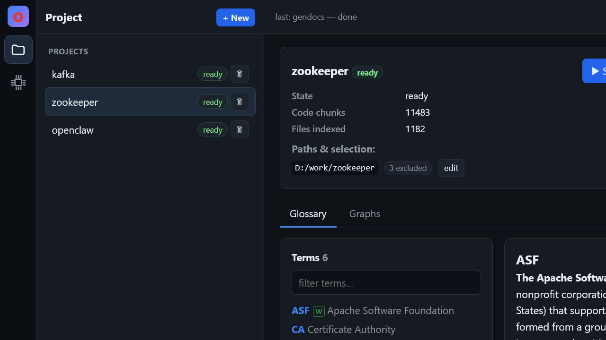
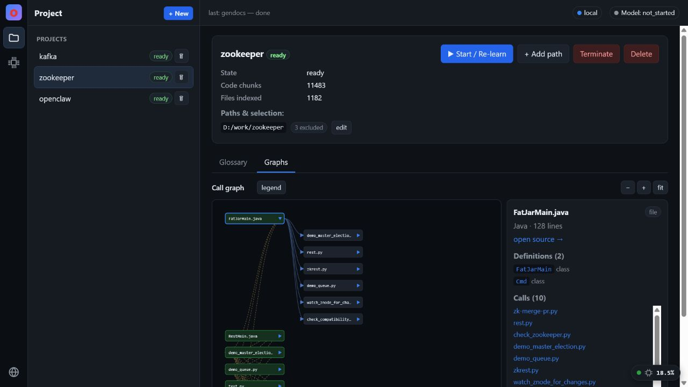
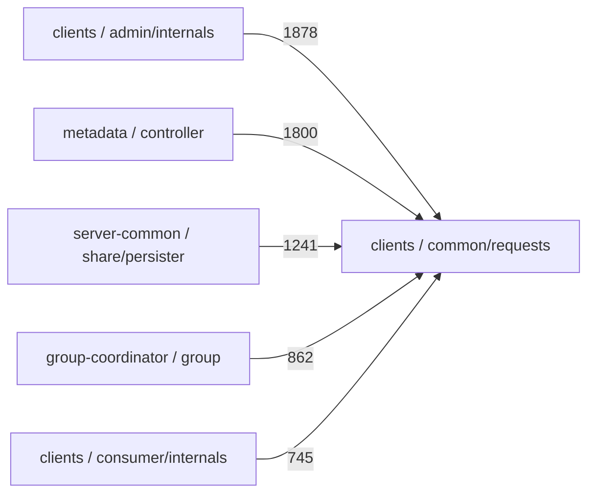

<div>

# Open Mind

**A verification-first code intelligence layer for AI agents.**

Open Mind turns a local repository into deterministic, source-traceable context
that coding agents can query without relying on guesses for indexed facts: a
verbatim glossary, structure and call graphs, exact-token search, grounded Q&A
context, saved solved cases, and an MCP tool surface.

</div>

[](https://github.com/HelloThisWorld/open-mind/actions/workflows/ci.yml)
[](https://www.python.org/)
[](LICENSE)
[](#use-it-from-an-agent-mcp)
[](#verification-first-design)
[](#measured-skill-verification)
[](#local-first-boundary)
[](https://github.com/HelloThisWorld/agent-skill-verification-template)

Open Mind is built around one practical agent-engineering problem:

> AI agents are only useful on real codebases when their context is reliable.
> A fluent but unsupported explanation of a system is not intelligence; it is a
> production risk.

Instead of asking a model to "understand" a repository from scratch, Open Mind
builds durable artifacts from the code itself. The model, editor, or agent then
queries those artifacts. If the repository does not support a claim, Open Mind
prefers a precise "not found" over a plausible hallucination.

Related projects:
- [Open Mind](https://github.com/HelloThisWorld/open-mind): generates source-traceable codebase artifacts
- [open-mind-mcp-server](https://github.com/HelloThisWorld/open-mind-mcp-server): exposes those artifacts as MCP tools for agents
- [agent-skill-verification-template](https://github.com/HelloThisWorld/agent-skill-verification-template): tests agent skills/tools with evals, metrics, traces, and replay artifacts

## Actual Project Demo

Screenshots below are captured from the running Open Mind UI against an indexed
ZooKeeper repository. They show the implemented product surface: source-grounded
glossary entries and structure-derived graph navigation.

| Verbatim glossary with provenance | Source-derived graph node detail |
|---|---|
|  |  |

---

## Why Open Mind

Large repositories are hard for people to learn and easy for LLMs to
misrepresent. A coding assistant can confidently invent an acronym expansion,
draw a non-existent architecture boundary, or recommend an edit based on a
symbol that only matched as a substring.

Open Mind takes the opposite approach:

- **Evidence over fluency** - important answers are grounded in source files,
  line numbers, line ranges, or explicit "not found" responses.
- **Determinism before generation** - glossary extraction, structure maps,
  token matching, routing defaults, and graph projections are deterministic.
- **Agent context as infrastructure** - the repository becomes a queryable
  knowledge layer for AI agents, Claude Skills-style workflows, editors, and
  safer AI-assisted development.
- **Useful omission over hallucination** - unsupported terms and unresolved
  graph edges are not filled in by the model.

This is the project thesis:

> Open Mind proves that reliable AI agent behavior starts with verifiable
> context, not bigger prompts.

---

## What It Builds

Point Open Mind at a local repository and it builds persisted artifacts:

| Artifact | Implemented behavior |
|---|---|
| **Source-traceable knowledge index** | Stores repo-relative paths, content hashes, source locations, file metadata, and search chunks. |
| **Canonical Asset model** (v2 Phase 2) | Every indexed file is an **Asset**; every observed version an immutable **Revision**; each revision divided into deterministic **Segments**, each with source-locatable **Evidence**. Historical content is snapshotted in an immutable SHA-256 content store, so evidence for an old revision stays readable after the file changes. Unchanged re-ingestion creates no revision and never re-embeds; removed files are marked removed without erasing history. |
| **Verbatim glossary** | Extracts terms/acronyms from definition tables, definition lines, acronym expansions, and code comments; definitions are copied verbatim and carry `source_file`, `line_number`, and `content_hash`. The interactive learn path scans code/config sources; the `.openmind` export walk additionally scans README/docs/GLOSSARY files (primary definition sources). |
| **Structure and graph map** | Builds a module tree, per-file definition index, import/dependency graph, entry points, and a name-based call/usage graph. Ambiguous call edges are flagged instead of guessed. |
| **Exact-token + hybrid search** | Bare identifiers use token-boundary matching; natural-language queries use vector + lexical retrieval. |
| **Grounded Ask context** | Assembles numbered sources from glossary hits, retrieved code, solved cases, prior conversation context, and user attachments for a local model to answer from. |
| **Saved solved cases** | Lets useful Ask exchanges become searchable cases; referenced files are hash-checked later and flagged stale if code changes. |
| **Agent tool surface** | Exposes core query, routing, case, and constrained fix tools through an MCP stdio server. |
| **Portable artifact export** | Exports a versioned `.openmind` directory (manifest + glossary, architecture, flows, source index — all with `file:line` evidence) as the stable contract for external consumers such as the companion MCP server. |
| **Template profiles** | Declarative YAML/JSON "lens" files describing a stack (built-ins `generic`, `spring-boot`, `rails`, `django`, `express-nestjs` ship in `openmind/templates/`; drop your own into `<data dir>/templates/` — same schema, user files win by name). A schema gate lists invalid files with their errors; deterministic stack detection scores profiles at learn time and records the winner per project with the evidence it matched on (`GET /templates`, `GET/POST /projects/{id}/template`). The resolved profile then classifies files into logical **roles** (controller/service/repository/…) and captures **facets** — verbatim regex facts such as HTTP route paths or Kafka topic literals, each with `file:line:snippet` evidence — persisted at learn time, surfaced through `/structure` (layer summary) and `/graph` (per-node role + facts), and projected into the `.openmind` export. No template resolved -> behavior and output are unchanged. |
| **Template learning guide** | Renders the resolved profile's `guide` outline into markdown pages after every learn (`GET /docs`, `GET /docs/{page}`, MCP `get_doc`; regenerate via `POST /gendocs`). Each section is one deterministic query over the learned maps (overview / layers / entry points / flows / facets / glossary / modules); every fact cites `file:line`, empty sections say so honestly, regeneration is byte-identical, and an `OPENMIND:NOTES` block per page preserves human annotations across rebuilds. No guide -> the docs surface stays an honest empty shell. |
| **Test-gated codemod path** | Provides a narrow literal find/replace path: preview a diff, require a green baseline, apply, rerun tests, and revert on red. |

What this is **not**: a full compiler, type checker, IDE extension, or free-form
autonomous coding agent. It is the source-grounded context and verification layer
that such agents can call.

---

## Canonical Asset Model (v2 Phase 2)

OpenMind v2 introduces a canonical content-identity model beneath the retrieval
index. The vector store becomes a *projection*; the durable source of truth is:

```text
Workspace                       the project (id p_*; the REST API still says /projects)
└── Asset                       one logical engineering object — a source/config file
    └── Revision                an immutable observation of that file's exact bytes
        ├── Segment             a stable structural unit (Java type/method/constructor,
        │                       or a deterministic line-range) — verbatim or derived
        └── Evidence            a source-locatable citation, recoverable from the snapshot
```

- **Workspace vs Asset vs Revision.** A *Workspace* is the existing project. An
  *Asset* is one file, identified by its normalized workspace-relative path (no
  absolute path ever enters the portable database). A *Revision* is one observed
  version of that file's bytes; the first observation is sequence 1, a change
  creates the next sequence and supersedes the previous, and a revert (A → B → A)
  is a new revision that reuses the old content blob.
- **Content snapshots.** Each revision's exact bytes are stored in an immutable,
  content-addressed blob store (`data/<workspace>/objects/…`, keyed by SHA-256).
  The database stores only the hash. This is why Evidence for a historical
  revision stays readable after the source file changes on disk — and why vector
  chunks are a *projection*, not the canonical store.
- **Unchanged ingestion reuses revisions.** Re-ingesting an unchanged file
  creates no new revision and does not re-embed it. A Phase 1 workspace backfills
  Assets on its first Phase 2 ingest *without* re-embedding unchanged files
  (their existing Chroma chunks are reused).
- **Removed files preserve history.** Deleting a source file marks its Asset
  `removed` and drops its live retrieval chunks, but keeps every revision,
  segment, evidence and content blob. Only workspace *terminate* / *delete* wipe
  Asset history.
- **Inspect it** through the CLI (`openmind asset list|show|revisions|segments|
  evidence|add`), additive read-only REST endpoints under `/projects/{id}/…`,
  and read-only MCP tools (`list_assets`, `get_asset`, `get_asset_revisions`,
  `get_evidence`) usable straight from Claude Code.

Deliberately **not** in this phase (still later v2 work): PDF/DOCX/XLSX parsing,
requirement and business-rule extraction, Claim/Relation tables, Knowledge-Graph
edges and requirement-to-code traceability. Nothing here claims document
knowledge or traceability exists yet. Full design:
[docs/v2/phase-2-asset-model.md](docs/v2/phase-2-asset-model.md).

---

## Built For AI Agent Workflows

Open Mind is designed as infrastructure for practical AI agents and tool
integrations:

- **Repository onboarding** - quickly inspect glossary terms, modules, entry
  points, dependencies, callers, and callees.
- **Context engineering** - give an agent durable repository context instead of
  relying on one long prompt.
- **Codebase Q&A grounding** - assemble source-numbered context for a local LLM,
  with glossary questions routed through deterministic lookup first.
- **Architecture discovery** - inspect structure-derived modules, dependencies,
  calls, and entry points without model-inferred architecture diagrams.
- **Change impact exploration** - inspect name-based caller/callee neighborhoods
  and related glossary terms before editing.
- **Tool-use verification** - use constrained MCP tools such as `propose_fix`
  and `apply_fix`, where tests decide whether a change is kept.
- **Safer AI-assisted development** - prefer source evidence, explicit
  uncertainty, and repeatable artifacts over one-off generated summaries.

This is directly relevant to AI Agents, Claude Skills, tool integrations,
context engineering, verification pipelines, systems design, and reliable
software development.

---

## Verification-First Design

Open Mind treats ambiguity as a risk signal:

- **Glossary definitions are verbatim.** They are never summarized or rewritten
  by a model. If a term is absent, lookup returns `found: false`.
- **Source locations are first-class.** Glossary entries carry `file:line`;
  search chunks carry line ranges; graph node details expose source files,
  definitions, callers, callees, and related terms.
- **Graphs are source-derived.** Dependency and call/usage graphs come from
  deterministic static analysis. The call graph is name-based, so ambiguous
  symbol targets are marked `ambiguous`.
- **Exact tokens stay exact.** `ack` does not match `acked`; `user` does not
  match `userId`; `service1` does not match `service10`.
- **Routing has a deterministic floor.** The optional local model may refine a
  capability choice, but only if it returns a valid capability. Otherwise the
  deterministic router stands.
- **Code writes are gated.** The codemod path is one-file literal find/replace,
  with diff preview and test-gated apply/revert behavior.

The local model is useful, but it is not trusted as the source of truth. The
source artifacts are.

---

## In Action

### Verbatim Glossary Lookup

An explicit acronym question routes to the glossary map, not similarity search:

```text
query: "what does ISR mean?"

{
  "found": true,
  "term": "ISR",
  "definition": "In-Sync Replicas",
  "source_file": "server/src/main/java/org/apache/kafka/server/partition/PartitionState.java",
  "line_number": 24,
  "source_kind": "acronym",
  "content_hash": "29122a12..."
}
```

An unsupported term is an honest miss:

```text
query: "what does ZKQ mean?"

{
  "found": false,
  "term": "ZKQ",
  "message": "no authoritative definition found for 'ZKQ' in the indexed project"
}
```

### Source-Derived Graphs

Graph views are projections of the structure artifact, not model-generated
architecture guesses. The example below shows the output shape of a module
rollup; edge weights are recovered reference counts from an indexed checkout,
not benchmark claims:



In the UI, clicking a graph node opens source location, definitions,
callers/callees, and cross-linked glossary terms.

### Exact-Token Search

Bare identifiers are matched as complete tokens:

```text
search "ApiKeys"        -> enum/class/interface chunks containing token ApiKeys
search "user"           -> token user, not userId unless subword mode is enabled
search "service1"       -> token service1, not service10
```

### Agent Consumption

An agent can call Open Mind over MCP and receive structured, source-grounded
results:

```text
tool: get_glossary
args: { "scope": "kafka", "term": "ISR" }

result:
  found: true
  definition: "In-Sync Replicas"
  source_file: "..."
  line_number: 24
```

That output can be used directly in a coding-agent prompt, audit trail, or
verification pipeline.

---

## How This Differs From Generic RAG

Generic code RAG usually does this:

1. Chunk the repository.
2. Embed the chunks.
3. Retrieve similar text.
4. Ask a model to synthesize an answer.

Open Mind still uses local embeddings for conceptual retrieval, but it does more
before the model is involved:

- builds a deterministic glossary artifact for term/acronym lookup;
- builds a deterministic structure artifact for modules, definitions, imports,
  calls, and entry points;
- applies exact-token rules before vector similarity for identifier queries;
- exposes capability routing with a deterministic fallback;
- keeps source paths portable and traceable;
- provides constrained tool APIs that agents can call safely.

The goal is not "chat with a repo." The goal is reliable repository context that
an AI agent can inspect, cite, and act on.

---

## Quick Start

**Prerequisites:** Python 3.12+ on Windows, macOS, or Linux.

```bash
git clone https://github.com/HelloThisWorld/open-mind.git
cd open-mind
pip install -r requirements.txt
```

Open Mind is a **headless runtime with several front ends**. The CLI, the MCP
server and the FastAPI app all drive the same code — the web UI is one adapter
over the runtime, not the place behaviour is defined, and it is entirely
optional.

### Tool-first (no UI)

```bash
# check the runtime: data dir, database, schema version, backends
python -m openmind.cli doctor

# create a workspace over a local repository
python -m openmind.cli init --name demo --path ./fixtures/sample-repo

# learn it (incremental; unchanged files are skipped by content hash)
python -m openmind.cli ingest --workspace <id> --wait

# what does it know?
python -m openmind.cli status --workspace <id>

# inspect the canonical Asset model: files -> revisions -> segments -> evidence
python -m openmind.cli asset list --workspace <id> --type source-code --json
python -m openmind.cli asset revisions --workspace <id> --asset <asset-id> --json
python -m openmind.cli asset evidence --workspace <id> --evidence <evidence-id> --json

# expose the knowledge layer to an editor or agent over MCP
python -m openmind.cli mcp serve

# ...or start the optional web UI
python -m openmind.cli serve
```

Every command takes `--json` for one machine-readable object on stdout, with
diagnostics on stderr and [stable exit codes](docs/cli.md#exit-codes), so the
runtime scripts cleanly:

```bash
WS=$(python -m openmind.cli init --name demo --path ./src --json | jq -r .workspace_id)
python -m openmind.cli ingest --workspace "$WS" --wait --json | jq '.progress'
python -m openmind.cli status --workspace "$WS" --json | jq '.counts'
```

Full contract: **[docs/cli.md](docs/cli.md)**.

### Web UI

```powershell
./run.ps1                              # Windows
```

```bash
python -m openmind.cli serve           # cross-platform
python -m uvicorn openmind.main:app --host 127.0.0.1 --port 8077   # equivalent
```

Then open `http://127.0.0.1:8077`, create a project, select a local repository,
and start learning. The deterministic glossary, graph, and exact-token search
features do not require an LLM. Ask/Q&A uses an optional local
OpenAI-compatible `llama-server`.

The server binds to loopback by default and refuses a non-loopback bind unless
you pass `--allow-non-loopback` explicitly.

### Things worth knowing

* **The UI is optional.** Nothing in the CLI or MCP path needs it running.
* **One runtime, one bootstrap.** CLI, MCP and FastAPI share the same
  configuration, database connection, migrations and services, so a workspace
  created in one is immediately visible in the others.
* **`--workspace` is the project id.** The stored entity is still a *project*
  and the REST API still says `/projects`; "workspace" is internal vocabulary
  that a later phase will build on. Nothing about the stored shape changed.
* **The artifact schema is stable.** `.openmind` export stays at schema **1.x**;
  external consumers keep working. Export is standalone — it needs no database,
  vector store or model, and runs with nothing but the standard library.
* **Schema changes are migrations.** The database carries a version and upgrades
  itself; an existing project database is baselined, never recreated. See
  [docs/database-migrations.md](docs/database-migrations.md).
* Enterprise Asset and Knowledge Graph models are **future v2 work** and are not
  implemented — see [Roadmap](#roadmap).

---

## Use It From An Agent (MCP)

Open Mind ships an MCP stdio server. Either command starts the same server —
they share one implementation, not two copies of the tools:

```bash
python -m openmind.mcp_server
python -m openmind.cli mcp serve
```

Example client registration:

```json
{
  "mcpServers": {
    "open-mind": {
      "command": "python",
      "args": ["-m", "openmind.mcp_server"]
    }
  }
}
```

Implemented MCP tools:

| Tool | Purpose |
|---|---|
| `search` | Hybrid code search with exact-token behavior for bare identifiers. |
| `get_glossary` | Deterministic term/acronym lookup or full term list. |
| `route` | Capability routing with deterministic fallback. |
| `dispatch` | Route a query and invoke the chosen capability. |
| `find_similar_cases` | Search saved solved cases, with staleness flags. |
| `save_case` | Save a problem/resolution as a reusable case. |
| `get_doc` | A generated learning-guide page (template `guide` sections; deterministic, `file:line`-cited), or an honest miss when no template guide applies. |
| `propose_fix` | Preview a literal find/replace as a unified diff. |
| `apply_fix` | Apply the literal replacement only if the test suite stays green. |

---

## Using Open Mind With MCP-Compatible Agents

Open Mind is standalone: everything above runs without any other project. For
agent integrations there is additionally a **stable artifact contract** — Open
Mind exports its knowledge as a versioned `.openmind` directory, and the
companion [open-mind-mcp-server](https://github.com/HelloThisWorld/open-mind-mcp-server)
loads that directory and exposes it as MCP tools (search, symbol evidence,
architecture explanations, claim validation):

```
Source Code Repository
  -> Open Mind                       (this repo; analysis, standalone)
  -> .openmind artifacts             (manifest.json + schema 1.1.0)
  -> open-mind-mcp-server            (optional integration layer)
  -> Claude / Cursor / AI agents     (MCP tools, structured JSON, file:line evidence)
```

The integration boundary is deliberately narrow: **`manifest.json` plus the
versioned artifact schema**. Open Mind never imports or starts the MCP server;
the MCP server never imports Open Mind's internals or re-runs its analysis.
Either project works without the other — the MCP server ships sample
artifacts, and Open Mind's artifacts are plain JSON any consumer can read.

Generate artifacts (deterministic, offline, no LLM and no extra dependencies —
the export path runs on a bare Python install; PyYAML is optional and only
gates YAML template profiles, which degrade to "no template applied"):

```bash
python -m openmind.artifacts --repo ./fixtures/sample-repo --output ./.openmind
# or via the npm task-runner shim, equivalently:
npm run analyze -- --repo ./fixtures/sample-repo --output ./.openmind
```

Then expose them to agents:

```bash
cd ../open-mind-mcp-server
npm install
npm run demo -- --artifacts ../open-mind/.openmind
```

The `.openmind` directory contains `manifest.json`, `metadata.json`,
`glossary.json`, `architecture.json`, `flows.json`, and `source-index.json`.
Every entry carries `{file, line, snippet}` evidence with repo-relative paths
and a `high`/`medium`/`low` confidence; verbatim glossary extraction is
`high`, heuristic projections (directory modules, name-based call flows) are
`medium` or lower. Point `--repo` at any local repository to export artifacts
for your own codebase. The contract is verified by
`python tests/verify_artifacts.py` (schema, evidence validity against the
analyzed repo, and byte-identical determinism).

Schema 1.1.0 is additive: when a template profile applies (deterministic
auto-selection, or `--template NAME`; `--no-template` opts out entirely),
`metadata.template` records it, `architecture.json` gains role-classified
`layers` (with evidence) and per-component `roles` counts, and flows are named
from verbatim facet captures (e.g. `HTTP route: Post /orders`). Without a
template the extra keys are absent and the output keeps the 1.0.0 shape —
consumers accepting `1.x` keep working either way.

---

## Capabilities As Skills

The tracked repository documents core capabilities as `SKILL.md` contracts:

| Skill contract | What it covers | Status |
|---|---|---|
| [`glossary`](skills/glossary/SKILL.md) | Verbatim term/acronym extraction and exact lookup. | Implemented · verified 90/90 runs |
| [`code-graphs`](skills/code-graphs/SKILL.md) | Structure, dependency, call, and entry-point-flow maps. | Implemented · verified 80/80 runs |
| [`capability-router`](skills/capability-router/SKILL.md) | Agent-style routing with deterministic fallback. | Implemented · verified 80/80 runs |

These are Claude Skills-style capability specifications: small, explicit,
auditable units with deterministic contracts. Every skill is paired with the
[Agent Skill Verification Template](https://github.com/HelloThisWorld/agent-skill-verification-template)
— a companion project that treats agent skills as production components, pairing a
model-independent contract with an offline eval harness, source-grounding
validators, replayable run artifacts, and a release gate. The "verified" numbers
above are measured, not asserted — see
[Measured Skill Verification](#measured-skill-verification) for the methodology,
the latest results, and how to reproduce them. Packaging the skills as
installable Claude Skills is listed in the roadmap; the current repo already exposes
the core tool surface through REST and MCP.

---

## Measured Skill Verification

The three capability skills are evaluated end to end with the
[Agent Skill Verification Template](https://github.com/HelloThisWorld/agent-skill-verification-template)
as an **independent harness**. The template does not reimplement Open Mind: it
drives the real Python implementation (`openmind/glossary.py`,
`openmind/structure.py`, `openmind/router.py`) through
[`openmind/skill_bridge.py`](openmind/skill_bridge.py), a JSON-lines
stdin/stdout bridge that builds the glossary and structure artifacts for a
fixture corpus and answers lookup/usage/definition/route requests from them.

Each skill has a machine-readable contract, happy-path test cases, and negative
(honesty) test cases in the template repo (`skills/openmind-*/`,
`testcases/openmind-*.json`). Every case runs **10 times**, and every run is
graded by four validators:

1. **Schema** — the output matches the required structured shape.
2. **Citation** — the harness independently re-reads every `file:line` Open
   Mind cites and checks the line exists, supports the claim, and carries the
   queried term/symbol. A fabricated citation fails the run.
3. **Unsupported claim** — unknown inputs must return `insufficient_evidence`
   with zero claims (never an invented answer); answered claims must all be
   cited; forbidden hallucination markers must be absent.
4. **Tool call** — the contract's required tools were called, in order.

### Latest results (2026-07-02 · 10 runs per case · gate threshold 90%)

| Skill under eval | Test cases | Total runs | Pass rate | Citation valid | Tool errors | Gate |
|---|---|---|---|---|---|---|
| `openmind-glossary` | 9 (7 happy + 2 negative) | 90 | **100%** | 100% | 0% | PASSED |
| `openmind-code-graphs` | 8 (6 + 2) | 80 | **100%** | 100% | 0% | PASSED |
| `openmind-capability-router` | 8 (6 + 2) | 80 | **100%** | 100% | 0% | PASSED |

**250/250 runs green across repeated executions** — consistent with the
determinism contract (same input → same output). The negative cases pass by
*declining*: unknown terms and symbols return `insufficient_evidence` with zero
claims, and the router cannot be talked into a capability outside its documented
set (a query asking it to "invent a new capability called quantum" routes to the
safe `search` floor, and "quantum" never appears as a routed capability).

Machine-readable snapshots of these runs are committed under
[`docs/verification/`](docs/verification/).

### The gate demonstrably catches bad outputs

A green report only means something if the same pipeline turns red on bad
output. The template's flaky-twin methodology perturbs Open Mind's correct
outputs per run seed — dropped citations, line numbers shifted by +7, an invalid
status value, reversed tool order, an invented uncited claim — and the gate
fails exactly as it should:

| Skill under seeded faults | Pass rate | Gate | Replay artifacts |
|---|---|---|---|
| `openmind-glossary` | 52.2% | FAILED | 43 |
| `openmind-code-graphs` | 58.8% | FAILED | 33 |
| `openmind-capability-router` | 33.8% | FAILED | 53 |

Every seeded fault maps back to the validator built to catch it
(`citation_line_out_of_range`, `answered_claim_without_citation`,
`tool_order_violation`, schema rejection of an invalid status, …), and every
failed run leaves a replay artifact with the exact input, output, tool trace,
and verdict.

### Reproduce

```bash
# clone the harness next to this repo (or point OPENMIND_REPO at this checkout)
git clone https://github.com/HelloThisWorld/agent-skill-verification-template.git
cd agent-skill-verification-template
npm install

npm run eval:openmind          # all three skills; non-zero exit if the gate fails
npm run eval:openmind:flaky    # proof the gate catches seeded failures
```

Each eval writes a self-contained `report.html`, a `summary.json`, Prometheus
metrics, structured JSONL events, and (on failure) per-run replay artifacts
under the template's `reports/` directory.

---

## Implementation Map

```text
openmind/
  cli.py           the command-line front end (argparse; JSON + exit codes)
  runtime.py       composition root: one idempotent bootstrap for every adapter
  version.py       the single runtime version constant
  domain/          typed application errors + the types crossing service calls
  ports/           the three narrow boundaries services depend on
  services/        use-case orchestration shared by CLI, MCP and FastAPI
                   (workspace, ingest, job, asset, export, health + the container)
  content_store.py immutable SHA-256 content-addressed blob store (revision snapshots)
  segmentation.py  deterministic Segment + Evidence drafts (shares boundaries with rag)
  migrations/      versioned, checksummed SQLite schema migrations (v0003 = Asset model)
  walker.py        selection-aware walk, .gitignore handling, hashing
  detect.py        manifest/language detection and stack cues
  langspec.py      declarative language registry
  templates.py     declarative template profiles: schema gate + deterministic
                   stack-match auto-selection
  facets.py        template facet extraction: role classification + verbatim
                   capture facts, all with file:line evidence
  docs.py          template-driven learning guide: guide sections -> cited,
                   deterministic markdown pages (notes preserved across rebuilds)
  structure.py     deterministic modules, definitions, imports, calls, entries
  diagrams.py      Mermaid/DOT/interactive graph projections
  glossary.py      verbatim glossary extraction and lookup
  tokenmatch.py    exact identifier/literal boundary matching
  rag.py           code chunking, local embedding, hybrid retrieval
  embeddings.py    fastembed/ONNX backend with deterministic hashing fallback
  vectorstore.py   Chroma persistence with numpy fallback
  ask.py           source-numbered grounded prompt assembly
  conversation.py  bounded retained Ask history
  cases.py         saved solved cases and staleness checks
  router.py        deterministic capability routing plus optional model refine
  codemod.py       preview/apply literal edits with test gating
  artifacts.py     .openmind artifact export (the stable integration contract)
  mcp_server.py    MCP stdio server
  skill_bridge.py  JSON-lines bridge exposing the skills to the eval harness
  main.py          FastAPI REST/SSE API and single-page UI (one adapter)
  netguard.py      audited outbound HTTP guard for app-controlled egress
  machine.py       machine-local source roots and GitHub source links
  jobs.py          resumable background jobs for ingest, Ask, enrichment
```

Language support is defined in `openmind/langspec.py` and currently covers
Python, JavaScript, TypeScript, Java, Kotlin, Scala, Go, Rust, C#, Ruby, PHP, C,
and C++ at the line-oriented structure layer. Java also has tree-sitter semantic
chunking for richer RAG chunks when available.

---

## Local-First Boundary

Open Mind is local-first:

- indexed project content is read from local disk;
- persisted artifacts store repo-relative paths where possible;
- local model calls are pinned to loopback through `netguard`;
- Wikipedia glossary enrichment and GitHub source-link fetches are separate,
  audited egress paths and can be disabled;
- embeddings run in-process after model weights are available.

One important precision: `fastembed` may download embedding model weights on
first use. Set `OPENMIND_EMBED_OFFLINE=1` to force the deterministic hashing
embedder and prevent that model download path.

---

## Configuration

Everything works with defaults. Useful environment variables:

| Variable | Default | Purpose |
|---|---|---|
| `OPENMIND_DATA_DIR` | `./data` | SQLite, Chroma, maps, logs, and learned artifacts. |
| `OPENMIND_MACHINE_DIR` | `~/.openmind` | Machine-local source roots and GitHub source links, kept outside portable data. |
| `OPENMIND_EMBED_DEVICE` | `smart` | `cpu`, `smart`, `auto`, or `gpu` for ONNX execution providers. |
| `OPENMIND_INGEST_FREE_GPU` | `1` | Temporarily stop Open Mind's managed model server during bulk embedding when useful. |
| `OPENMIND_EMBED_OFFLINE` | `0` | `1` forces hashing embeddings and prevents embedding model download. |
| `OPENMIND_ENRICH_EGRESS` | `1` | `0` disables Wikipedia enrichment lookups. |
| `OPENMIND_SOURCELINK_EGRESS` | `1` | `0` disables GitHub raw-file fetches for linked source. |
| `OPENMIND_MODELS_FOLDER` | `~/models` fallback | Default folder for local `.gguf` model selection. |
| `OPENMIND_MODEL_PATH` | empty | Default local model path. |
| `OPENMIND_LLAMA_SERVER` | `llama-server` | Local OpenAI-compatible model server binary. |

Optional GPU embedding packages:

```powershell
# Windows AMD/Intel
pip uninstall onnxruntime
pip install onnxruntime-directml

# NVIDIA
pip install onnxruntime-gpu
```

---

## Testing

Two layers of checks back the claims in this README.

**Skill-level eval harness** — the three capability skills are verified with the
[Agent Skill Verification Template](https://github.com/HelloThisWorld/agent-skill-verification-template)
(10 runs per test case, four validators, release gate); see
[Measured Skill Verification](#measured-skill-verification) for the latest
results and reproduction steps.

**Focused acceptance scripts** — small checks covering the verification
contracts implemented in this build. One command runs the supported suite:

```bash
python scripts/run_acceptance.py           # the CI gate (core tier)
python scripts/run_acceptance.py --all     # every tier, including local-only
python scripts/run_acceptance.py --list    # what is in the suite, and why
python scripts/run_acceptance.py --only verify_migrations
```

The runner gives each script its own isolated `OPENMIND_DATA_DIR` and
`OPENMIND_MACHINE_DIR`, forces offline embeddings and disables all egress, and
returns non-zero on any failure. Two properties are deliberate: **a skipped
core script is counted as a failure**, never a pass, and **every
`tests/verify_*.py` on disk must be registered in the runner's manifest** — so a
new test cannot silently go unrun while the suite still reports green.

The individual scripts, each mapping to a concrete reliability claim:

```bash
python tests/verify_artifacts.py      # .openmind artifact contract: schema, evidence, determinism
python tests/verify_glossary.py       # verbatim extraction, provenance, honest miss
python tests/verify_structure.py      # detection, structure map, incremental reuse
python tests/verify_diagrams.py       # Mermaid/DOT projections and honest empty graphs
python tests/verify_router.py         # deterministic routing and model fallback validation
python tests/verify_source_link.py    # source-link parsing and audited egress policy
python tests/verify_resources.py      # ingest RAM guard behavior
python tests/verify_templates.py      # template profiles: schema gate, deterministic selection
python tests/verify_facets.py         # template facets: roles, captures, projections, honest empties
python tests/verify_guide.py          # learning guide: cited pages, notes preservation, honest reset
python tests/verify_grounding.py      # glossary-first Ask routing, honest miss/empty sources
python tests/verify.py                # 12 cross-cutting design invariants end to end
python tests/verify_migrations.py     # schema ledger: empty, legacy baseline, checksum, rollback
python tests/verify_runtime.py        # runtime bootstrap idempotency, worker opt-in, one version
python tests/verify_services.py       # application services and their typed errors
python tests/verify_cli.py            # CLI contract: JSON output, exit codes, every command
python tests/verify_adapters.py       # REST route, MCP tool and skill-bridge compatibility
```

The remaining `tests/verify_*.py` files are regression suites (Ask flows, model
server, async delete, specific fix batches). One script,
`verify_delete_responsive.py`, is excluded from the CI gate and marked
`local` in the manifest with its reason: it asserts sub-2-second API latency
while a delete drains, which a shared CI runner's scheduling jitter makes flaky.
Run it locally before releasing a change to the delete path.

Under the runner's setup the whole `tests/` directory passes on a fresh clone
against the neutral fixture repos in `fixtures/`.

---

## Roadmap

The following are not claimed as complete in the current build:

**v2 enterprise knowledge layer.** Two foundation phases have shipped:
Phase 1 is the tool-first runtime
([docs/v2/phase-1-core-foundation.md](docs/v2/phase-1-core-foundation.md)), and
Phase 2 is the canonical **Asset / Revision / Segment / Evidence** model plus the
immutable content store
([docs/v2/phase-2-asset-model.md](docs/v2/phase-2-asset-model.md)). The following
later-phase items are **not** implemented; the foundation creates extension
points for them rather than building them:

- Claim and Relation models;
- the engineering Knowledge Graph and requirement-to-code traceability;
- PDF, DOCX and XLSX parsing; OCR; COBOL and JCL support; requirement and
  business-rule extraction;
- cloud model providers (OpenAI, Anthropic, Bedrock, Azure, Vertex) — the
  runtime remains local-first with no cloud credentials;
- requirement-to-code traceability, conflict detection and branch overlays;
- webhook integration and a Bundle 2.0 artifact schema (export stays at
  schema 1.x);
- a typed worker pool or job DAG replacing the current single-worker engine.

**Other work not yet done:**

- installable Claude Skill packaging for the tracked capability contracts;
- deeper change impact analysis beyond name-based caller/callee neighborhoods;
- IDE extension integration;
- running the skill eval gate (hallucination resistance and source-citation
  quality are already measured by the companion harness) in this repo's own CI;
- an output citation verifier for model answers;
- broader tree-sitter parsers beyond Java;
- graph-specific MCP tools for node expansion and graph navigation;
- a first-class repository memory layer beyond retained Ask history and saved
  solved cases;
- a guide artifact in the `.openmind` export (learning-guide pages are
  currently generated app-side only);
- visual layer grouping in the Graphs UI (the per-node `role` data is already
  exposed by the API).

---

## Design Principles

- **Evidence over fluency.** A correct "not found" is better than a confident
  unsupported answer.
- **Traceability over vague summaries.** Useful facts should point back to source
  paths, lines, line ranges, or explicit extraction artifacts.
- **Determinism over clever guessing.** The system's default behavior should be
  repeatable without a model.
- **Ambiguity is data.** If a static edge is ambiguous, mark it; do not pretend
  the system knows more than it does.
- **Agent reliability over demo appeal.** Tool APIs, routing, local-first
  boundaries, and test gates matter more than a flashy chat interface.

---

## Contributing

Issues and pull requests are welcome. A good change keeps the core contract
intact:

- add source evidence for new facts;
- prefer deterministic extraction over model generation;
- add or update a focused `tests/verify_*.py` acceptance check;
- route new outbound network paths through an audited guard;
- keep future features clearly separated from implemented behavior.

---

## License

Released under the [MIT License](LICENSE).
